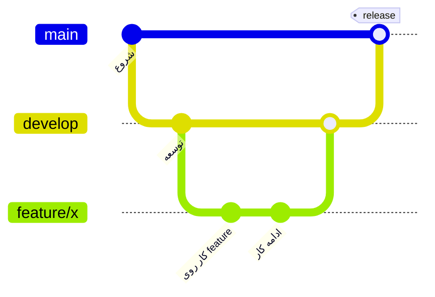
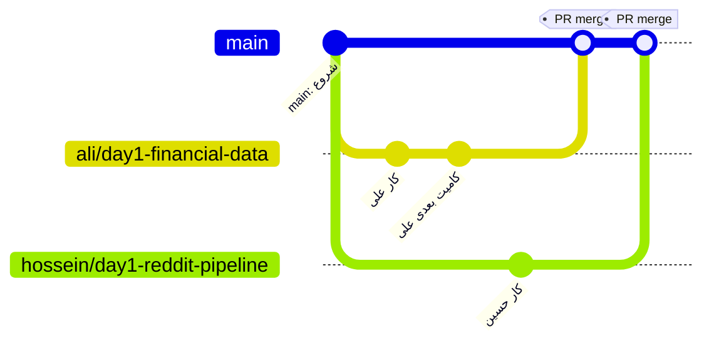

# راهنمای شروع به کار با Git و GitHub — مخصوص علی و حسین

این راهنما با فرض نوشته شده که تا الان هیچ کاری با Git نکردید. هدف اینه که
از صفر تا جایی که بتونید توی این پروژه (`media-sentiment-pipeline`) بدون
دردسر کار کنید پیش بریم. یه راهنمای دیگه هم توی ریشه پروژه هست
([`GIT_WORKFLOW.md`](../GIT_WORKFLOW.md)) که مختص قوانین همین تیمه — این
فایل مکمل اونه و مفاهیم پایه رو توضیح می‌ده.

---

## ۱. گیت (Git) چیه و گیت‌هاب (GitHub) چیه؟

این دو تا اسم شبیه هم‌ان ولی دو چیز متفاوت‌ان:

- **Git** یه نرم‌افزاره که روی کامپیوتر خودتون نصب می‌شه. کارش اینه که
  تاریخچه‌ی تغییرات فایل‌های یه پروژه رو ذخیره می‌کنه — یعنی هر بار که یه
  تیکه کد رو تغییر می‌دید و "ثبتش" می‌کنید (به این کار می‌گیم **commit**)،
  گیت یه عکس لحظه‌ای (snapshot) از وضعیت فایل‌ها می‌گیره. این‌جوری هر وقت
  بخواید می‌تونید برگردید به هر نسخه‌ی قبلی، ببینید چی عوض شده، یا کار چند
  نفر رو با هم ترکیب کنید بدون این‌که فایل‌ها رو دستی کپی/پیست کنید.
- **GitHub** یه سایته (github.com) که ریپوی گیت شما رو آنلاین هاست می‌کنه.
  یعنی یه نسخه‌ی مرکزی از پروژه اونجاست و هر ۴ نفرمون باهاش sync می‌کنیم.
  علاوه بر این، GitHub امکاناتی مثل **Pull Request** (درخواست ادغام کد) و
  ریویو کردن کد بقیه رو هم می‌ده.

خلاصه: **Git = ابزار محلی روی کامپیوتر شما / GitHub = سرور مرکزی + رابط
وب برای اشتراک‌گذاری و ریویو.**

چند تا اصطلاح که مدام می‌بینید:

| اصطلاح | یعنی چی |
|---|---|
| **Repository (ریپو)** | پوشه‌ی پروژه که گیت روش فعاله؛ ریپوی ما `media-sentiment-pipeline`ـه |
| **Commit** | یه "ثبت تغییرات" با توضیح کوتاه؛ مثل یه سیو با تاریخچه |
| **Branch (برنچ)** | یه خط زمانی جدا از کد، برای این‌که هرکس بدون خراب کردن کار بقیه کار کنه |
| **Remote** | نسخه‌ی آنلاینِ ریپو روی گیت‌هاب (اسمش پیش‌فرض `origin`ـه) |
| **Clone** | دانلود اولیه‌ی کل ریپو از گیت‌هاب روی کامپیوتر خودتون |
| **Push** | فرستادن commitهای شما از کامپیوتر به گیت‌هاب |
| **Pull** | گرفتن آخرین تغییرات از گیت‌هاب روی کامپیوتر خودتون |
| **Merge** | ترکیب کردن دو برنچ با هم |
| **Pull Request (PR)** | درخواست روی گیت‌هاب برای این‌که برنچ شما با `main` ادغام بشه |
| **Conflict** | وقتی گیت نمی‌تونه خودکار دو تغییر متفاوت روی یه خط از کد رو ترکیب کنه و شما باید دستی تصمیم بگیرید |

---

## ۲. نصب و تنظیم اولیه (فقط یه بار)

### نصب Git

1. از [git-scm.com/download/win](https://git-scm.com/download/win) دانلود
   کنید و نصب کنید (گزینه‌های پیش‌فرض نصب مشکلی ندارن، لازم نیست چیزی رو
   عوض کنید).
2. بعد از نصب، **Git Bash** روی سیستم‌تون نصب می‌شه — یه ترمینال مخصوص
   دستورات گیت. از همین برای دستورات پایین استفاده کنید (یا از PowerShell،
   فرقی نداره).

### معرفی خودتون به گیت (یه بار، توی همون ترمینال)

```bash
git config --global user.name "Ali"
git config --global user.email "ایمیل-گیت‌هابتون@example.com"
```

این اسم/ایمیل کنار هر commitی که می‌زنید ثبت می‌شه، تا معلوم باشه کار کیه.

### ساخت اکانت گیت‌هاب و گرفتن دسترسی

1. اگه اکانت ندارید، توی [github.com](https://github.com) بسازید.
2. از پارمیدا بخواید شما رو به‌عنوان **Collaborator** به ریپوی
   `parmida2b/media-sentiment-pipeline` اضافه کنه (از تنظیمات ریپو →
   Settings → Collaborators). بدون این مرحله نمی‌تونید `push` کنید.
3. **نکته مهم:** گیت‌هاب دیگه ورود با پسورد ساده رو قبول نمی‌کنه. وقتی
   اولین بار `push` می‌کنید ازتون می‌خواد لاگین کنید — ساده‌ترین راه اینه
   که وقتی پنجره‌ی لاگین گیت باز شد، از روش **مرورگر (Sign in with your
   browser)** استفاده کنید؛ خودش شما رو به صفحه گیت‌هاب می‌بره و بعد از
   تایید، دیگه لازم نیست هر بار لاگین کنید.

---

## ۳. شروع کار: کلون کردن ریپو

این کار رو فقط یه بار، برای اولین بار، انجام می‌دید:

```bash
git clone https://github.com/parmida2b/media-sentiment-pipeline.git
cd media-sentiment-pipeline
```

الان یه کپی کامل از پروژه (با کل تاریخچه‌اش) روی کامپیوتر خودتون دارید.

---

## ۴. مدل Git-flow — یعنی چی و چرا؟

**Git-flow** یه الگوی استاندارد و رایج برای مدیریت برنچ‌هاست، که می‌گه به
جای این‌که همه مستقیم روی یه برنچ کد بزنن، کار هرکس توی یه برنچ جدا انجام
بشه و بعد با یه فرآیند مشخص به برنچ اصلی برگرده. مدل کامل git-flow این
برنچ‌ها رو داره:



- **`main`** → همیشه پایدار و "قابل تحویل"ه.
- **`develop`** → خط اصلیِ در حال توسعه (بین feature branchها و main).
- **`feature/...`** → هر قابلیت/تسک جدید توی برنچ خودش ساخته می‌شه، از
  `develop` جدا می‌شه و دوباره به `develop` برمی‌گرده.
- (`release/...` و `hotfix/...` هم هستن، برای انتشار نسخه و رفع باگ فوری —
  ولی توی یه پروژه‌ی ۵ روزه‌ی دانشگاهی/تیمی مثل این، بهشون نیاز نداریم.)

### نسخه‌ی ساده‌شده‌ای که توی این پروژه استفاده می‌کنیم

چون تیم کوچیکه و پروژه کوتاه‌مدته، به‌جای مدل کامل، از یه نسخه‌ی ساده‌شده
استفاده می‌کنیم: **`main` نقش هر دوی `main` و `develop` رو با هم بازی
می‌کنه، و هر تسک یه `feature branch` مخصوص خودش داره.**



یعنی:
- هیچ‌وقت مستقیم روی `main` کد نمی‌زنید.
- برای هر روز/تسک، یه برنچ جدید از `main` می‌سازید.
- کارتون رو اونجا commit و push می‌کنید.
- با یه **Pull Request** به `main` برمی‌گردونیدش.

قالب اسم برنچ: `<اسمتون>/<روز>-<توضیح کوتاه انگلیسی>`

مثال‌های واقعی برای شما دو نفر:
- علی → `ali/day1-financial-data`، `ali/day2-temporal-analysis`
- حسین → `hossein/day1-reddit-pipeline`، `hossein/day2-schema-update`

---

## ۵. روال روزانه، قدم‌به‌قدم

### قدم ۱ — صبح، قبل از شروع کار: بیایید روی آخرین نسخه

```bash
git checkout main
git pull origin main
```

`checkout main` یعنی "برو روی برنچ main"، `pull origin main` یعنی "هر چی
بقیه دیروز اضافه کردن رو بیار روی کامپیوتر من".

### قدم ۲ — یه برنچ جدید برای کار امروز بسازید

```bash
git checkout -b ali/day1-financial-data
```

`-b` یعنی "این برنچ رو بساز و برو روش". از الان هرچی تغییر بدید، فقط توی
همین برنچ ثبت می‌شه، نه روی `main`.

### قدم ۳ — کار کنید، بعد تغییرات رو commit کنید

بعد از هر بخش منطقی از کار (نه فقط آخر روز)، تغییراتتون رو ثبت کنید:

```bash
git status                     # ببینید چه فایل‌هایی تغییر کرده
git add src/temporal_analysis/trend_analysis.py
git commit -m "temporal: افزودن محاسبه روند هفتگی sentiment"
```

- `git status` همیشه اول بزنید — نشون می‌ده چی تغییر کرده و چی هنوز
  commit نشده.
- `git add <فایل>` یعنی "این فایل رو برای commit بعدی آماده کن" (به این
  می‌گن staging).
- `git commit -m "..."` یعنی "همین چیزهایی که add کردم رو با این توضیح
  ثبت کن". پیام کوتاه ولی واضح بنویسید — بهتره با اسم بخش شروع بشه، مثلا
  `temporal: ...` یا `reddit: ...`.

commitهای کوچیک و مکرر بزنید، نه یه commit غول‌پیکر آخر روز — اگه یه جا
مشکل پیش بیاد راحت‌تر پیدا می‌شه کجا خراب شده.

### قدم ۴ — عصر (یا هر وقت به یه جای پایدار رسیدید): push کنید

```bash
git push origin ali/day1-financial-data
```

اولین بار که یه برنچ جدید رو push می‌کنید، گیت ممکنه بگه از این دستور
استفاده کنید (خودش پیشنهادش رو نشون می‌ده، کپی‌پیست کنید):

```bash
git push --set-upstream origin ali/day1-financial-data
```

### قدم ۵ — روی گیت‌هاب یه Pull Request بسازید

Push که کردید، این کار رو مستقیم توی مرورگر روی سایت گیت‌هاب انجام می‌دید،
نه توی ترمینال:

1. برید به صفحه‌ی ریپو روی github.com.
2. یه بنر زرد می‌بینید با متن مشابه *"ali/day1-financial-data had recent
   pushes"* و یه دکمه‌ی **Compare & pull request** — بزنیدش. (اگه بنر رو
   ندیدید، از تب **Pull requests** بالای صفحه، دکمه‌ی **New pull request**
   رو بزنید و برنچ خودتون رو انتخاب کنید.)
3. مطمئن شید جهت ادغام `base: main` ← `compare: <برنچ شما>` باشه.
4. یه عنوان و توضیح کوتاه بنویسید که چیکار کردید.
5. دکمه‌ی **Create pull request** رو بزنید.
6. اگه کسی هست که کد رو ریویو کنه، ازش بخواید. اگه نه (مثلاً وقت کمه)،
   خودتون دکمه‌ی **Merge pull request** رو بزنید.

چرا این کار رو حتی وقتی خودمون تنها ریویوکننده‌ایم انجام می‌دیم؟ چون
تاریخچه‌ی تغییرات شفاف می‌مونه و اگه بعداً چیزی خراب شد، راحت می‌تونیم
دقیقاً ببینیم کدوم PR باعثش شده و برگردیم عقب.

اگه واقعاً وقت PR ساختن روی گیت‌هاب رو ندارید، حداقل با merge دستی
(نه force-push) برگردونیدش:

```bash
git checkout main
git pull origin main
git merge ali/day1-financial-data
git push origin main
```

### قدم ۶ — فردا صبح، از اول (برو به قدم ۱)

هر روز از `main` بروزشده یه برنچ جدید می‌سازید؛ برنچ دیروز رو دیگه ادامه
نمی‌دید مگر کارش هنوز merge نشده باشه.

---

## ۶. اگه به Conflict خوردید، نترسید

Conflict یعنی شما و یه نفر دیگه یه خط از یه فایل رو با هم فرق تغییر دادید
و گیت نمی‌دونه کدوم رو نگه داره. معمولاً وقتی پیش میاد که `git pull`
می‌زنید:

```bash
git pull origin main
```

اگه conflict بود، گیت توی فایل مربوطه این‌شکلی نشونش می‌ده:

```
<<<<<<< HEAD
کدی که شما نوشتید
=======
کدی که از main اومده
>>>>>>> main
```

باید فایل رو باز کنید (توی VS Code یا هر ادیتوری)، خط‌های
`<<<<<<<` / `=======` / `>>>>>>>` رو پاک کنید و دستی تصمیم بگیرید کدوم
نسخه (یا ترکیب هر دو) بمونه. بعد:

```bash
git add <همون فایل>
git commit
git push
```

اگه مطمئن نبودید کدوم درست‌ـه، توی گروه بپرسید — بهتر از اینه که تصادفی
کد کس دیگه رو پاک کنید.

**بهترین راه برای کم کردن conflict:** قبل از هر `push`، اول `git pull
origin main` بزنید تا زود متوجه تداخل بشید (وقتی کوچیکه)، نه روز آخر که
انبوهی از تغییرات جمع شده.

---

## ۷. نکات مخصوص این پروژه

- **هرکس فقط توی پوشه‌ی خودش کد بزنه** تا conflict کمتر بشه:
  - علی → `src/temporal_analysis/` و `src/event_analysis/`
  - حسین → `src/ingestion/` (بخش Reddit) و یکپارچه‌سازی نهایی
  - `config/schema.py` (فرمت مشترک داده، ایده اولیه از یاسمن) دست پارمیداست — اگه فرمت داده
    نیاز به تغییر داره، اول توی گروه مطرح کنید، پارمیدا تغییرش بده، بقیه
    `pull` کنن.
- **فایل‌های داده وارد گیت نمی‌شن.** فایل‌های `.csv`/`.jsonl` توی
  `.gitignore` هستن؛ اگه `git status` یه فایل داده‌ی حجیم رو نشون داد که
  می‌خواد commit بشه، اضافه‌ش نکنید — برای رد و بدل دیتای واقعی از Google
  Drive یا لینک مشترک تیم استفاده کنید.
- **هیچ کلید API‌ای رو commit نکنید** (`YOUTUBE_API_KEY`,
  `GEMINI_API_KEY`, و امثالش). این‌ها فقط توی فایل `.env` (که خودش توی
  `.gitignore` هست) باشن، و کد همیشه با `os.environ` بخوندشون.
- قبل از هر `git add`، یه `git status` بزنید و مطمئن شید فقط فایل‌های
  کدی که واقعاً تغییر دادید اضافه می‌شن، نه چیز اضافه (مثلاً فایل‌های
  موقت ادیتور).

---

## ۸. چیت‌شیت دستورات پرکاربرد

| دستور | کاربرد |
|---|---|
| `git status` | چی تغییر کرده، چی staged/unstaged‌ـه |
| `git checkout main` | برو روی برنچ main |
| `git checkout -b <name>/dayN-...` | برنچ جدید بساز و برو روش |
| `git pull origin main` | آخرین تغییرات main رو بگیر |
| `git add <file>` | فایل رو برای commit بعدی آماده کن |
| `git add -A` | همه‌ی فایل‌های تغییریافته رو آماده کن (با احتیاط، بعد از `git status`) |
| `git commit -m "پیام"` | ثبت تغییرات با یه توضیح |
| `git push origin <branch>` | ارسال commitها به گیت‌هاب |
| `git log --oneline` | لیست کوتاه تاریخچه‌ی commitها |
| `git diff` | دیدن دقیق چی توی فایل تغییر کرده (قبل از add) |
| `git branch` | لیست برنچ‌های محلی؛ ستاره کنار برنچ فعلیه |

---

اگه هر جای این راهنما گنگ بود یا به مشکلی خوردید که این‌جا پوشش داده
نشده، توی گروه تیم بپرسید — بهتره اول بپرسید تا این‌که چیزی رو force
push کنید یا merge اشتباه بزنید.
